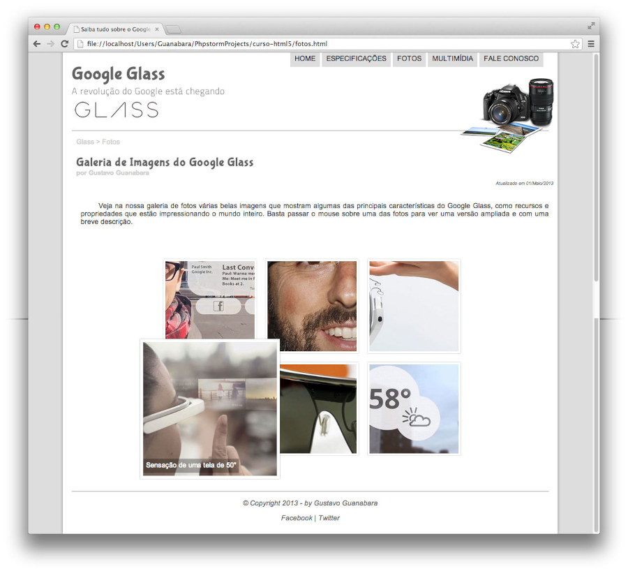

# projeto-site-google-glass

## Projeto atualizado e modificado do canal Curso em Vídeo. 

  

<h2>:bookmark_tabs: Descrição</h2>

 
Realizado no ano de 2013 pelo professor <em><strong>Gustavo Guanabara</strong></em> com 38 vídeos sem disponibilizar códigos prontos, ou seja, cada semana era lançado um vídeo mostrando passo a passo a criação de um site completo utilizando as três principais tecnologias do momento <strong>HTML5 + CSS3 + JavaScript</strong> de uma maneira simples e objetiva. Em 2022 atualizei e modifiquei o projeto com novas tags, scripts e imagens.

  

  

## IMPORTANTE

  
 
 

Você tem todo o direito de usar esse material para seu próprio aprendizado. Espero que seja útil o conteúdo disponibilizado.
 

<a href="https://ronaldobento.github.io/projeto-site-google-glass/index.html" target="_blank" rel="external" title="Clique aqui para entrar no site do projeto google glass"><strong>Clique aqui para entrar no site do projeto Google Glass ou utilize o QR Code abaixo</strong></a> 

 
