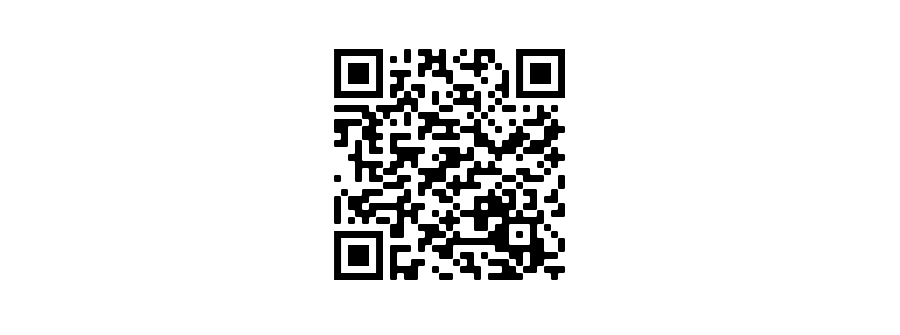

# projeto-site-google-glass
 Projeto do curso em vídeo de um site completo 

 IMPORTANTE
 Você tem todo o direito de usar esse material 
para seu próprio aprendizado. Espero que seja útil 
o conteúdo disponibilizado. 

 

<a href="https://ronaldobento.github.io/projeto-site-google-glass/index.html" target="_blank" rel="external" title="site google glass"><strong>site google glass</strong></a> 

 

